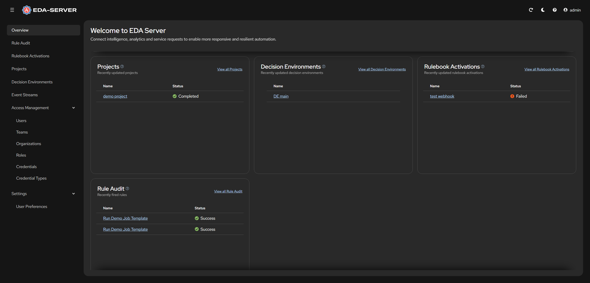

<!-- omit in toc -->
# 📚 Ansible EDA on Kubernetes

An example implementation of Ansible EDA on Kubernetes using EDA Operator, with easy-to-use simplified configuration with ownership of data and passwords.

- Accessible over HTTPS from remote host
- All data will be stored under `/data`
- Fixed (configurable) passwords for EDA and PostgreSQL
- Fixed (configurable) versions of EDA

## 📸 Screenshot

| Login                            | Home                           | Next UI                              |
| -------------------------------- | ------------------------------ | ------------------------------------ |
|  |  |  |

<!-- omit in toc -->
## 📝 Environment

- EDA Operator main
- EDA main
- PostgreSQL 15

P/s: At the time of this project, the eda server official repo had not released a new version since a year ago, so we chose the latest version in the main branch (see [deployment section](https://github.com/ansible/eda-server-operator/blob/main/docs/kustomize-install.md)).

## 📝 References

- [INSTALL.md on ansible/eda-server](https://github.com/ansible/eda-server/blob/main/docs/deployment.md) @main
- [README.md on ansible/eda-operator](https://github.com/ansible/eda-server-operator/blob/main/README.md) @main

## 📝 Requirements

- **2 CPUs minimum**.
  - Both **AMD64** (x86_64) with x86-64-v2 support, and **ARM64**  (aarch64) are supported.
- **4 GiB RAM minimum**.
  - It's recommended to add more CPUs and RAM (like 4 CPUs and 8 GiB RAM or more) to avoid performance issue and job scheduling issue.
  - The files in this repository are configured to ignore resource requirements which specified by EDA Operator by default.
- **Storage resources**
  - At least **10 GiB for `/data`** are safe for fresh install.

## 📝 Deployment Instruction

### ✅ Prepare K8s infrastructure

+ Install your own Kubernetes cluster
+ Setup default storageclass (Ex: [rancher/local-path-provisioner](https://github.com/rancher/local-path-provisioner))
+ Setup default ingressclass (Ex: [kubernetes/ingress-nginx](https://github.com/kubernetes/ingress-nginx))
+ Setup loadbalancer IP pools (Ex: [metallb/metallb](https://github.com/metallb/metallb))

### ✅ Install EDA Operator

Clone this repository and change directory.

```bash
git clone https://github.com/lucthienphong1120/ansible-event-driven
cd ansible-event-driven
```

Then invoke `kubectl apply -k operator` to deploy EDA Operator.

<!-- shell: operator: deploy -->
```bash
kubectl apply -k operator
```

The EDA Operator will be deployed to the namespace `eda`.

<!-- shell: operator: get resources -->
```bash
$ kubectl -n eda get pod
NAME                                                      READY   STATUS    RESTARTS   AGE
eda-server-operator-controller-manager-575c46bbff-d8dj6   2/2     Running   0          16s
```

### ✅ Prepare required files to deploy EDA

<!-- shell: instance: generate certificates -->
```bash
EDA_HOST="eda.example.com"
openssl req -x509 -nodes -days 3650 -newkey rsa:2048 -out ./server/cert.pem -keyout ./server/private.key -subj "/CN=${EDA_HOST}/O=${EDA_HOST}" -addext "subjectAltName = DNS:${EDA_HOST}"
```

Modify `hostname` in `server/eda.yaml` if you want to use Ingress.

```yaml
...
spec:
  ...
  ingress_type: ingress
  ingress_tls_secret: eda-secret-tls
  hostname: eda.example.com                         👈👈👈

  automation_server_url: https://awx.example.com/   👈👈👈
  automation_server_ssl_verify: no
...
```

Instead of using Ingress, uncomment there sections if you want to use `Loadbalancer` or `Nodeport` (Comment out Ingress section too!)

```yaml
...
spec:
  ...
  service_type: NodePort
  nodeport_port: 31000

  # service_type: LoadBalancer
  # loadbalancer_ip: '192.168.10.25'
  # loadbalancer_protocol: https
  # loadbalancer_port: 443
  # loadbalancer_class: service.k8s.aws/nlb

  # ingress_type: ingress
  # ingress_class_name: nginx
  # ingress_tls_secret: eda-secret-tls
  # hostname: eda.example.com 
...
```

Modify the two `password` entries in `server/kustomization.yaml`. Note that the `password` under `eda-postgres-configuration` should not contain single or double quotes (`'`, `"`) or backslashes (`\`) to avoid any issues during deployment, backup or restoration.

```yaml
...
  - name: eda-postgres-configuration
    type: Opaque
    literals:
      - host=awx-postgres-15
      - port=5432
      - database=eda
      - username=eda
      - password=password   👈👈👈
      - type=managed

  - name: eda-admin-password
    type: Opaque
    literals:
      - password=password   👈👈👈
...
```

Prepare directories for Persistent Volumes defined in `server/pv.yaml`. These directories will be used to store your databases and project files. Note that the size of the PVs and PVCs are specified in some of the files in this repository, but since their backends are `hostPath`, its value is just like a label and there is no actual capacity limitation.

<!-- shell: instance: create directories -->
```bash
sudo mkdir -p /data/eda/postgres-15/data
sudo chown 26:0 /data/eda/postgres-15/data
sudo chmod 700 /data/eda/postgres-15/data
```

### ✅ Deploy EDA

Deploy EDA, this takes few minutes to complete.

<!-- shell: instance: deploy -->
```bash
kubectl apply -k server
```

To monitor the progress of the deployment, check the logs of `deployments/eda-server-operator-controller-manager`:

<!-- shell: instance: gather logs -->
```bash
kubectl -n eda logs -f deployment/eda-server-operator-controller-manager
```

The deployment takes about 15 minutes. After it completes successfully, the logs end with:

```bash
$ kubectl -n eda logs -f deployment/eda-server-operator-controller-manager
...
----- Ansible Task Status Event StdOut (eda.ansible.com/v1alpha1, Kind=EDA, eda/eda) -----
PLAY RECAP *********************************************************************
localhost                  : ok=58   changed=0    unreachable=0    failed=0    skipped=20   rescued=0    ignored=0
```

The required objects should now have been deployed next to EDA Operator in the `eda` namespace.

<!-- shell: instance: get resources -->
```bash
$ kubectl -n eda get pod,svc,ingress

NAME                                                          READY   STATUS    RESTARTS   AGE
pod/eda-activation-worker-7d798c6d87-zqn7r                    1/1     Running   0          6m
pod/eda-activation-worker-7d798c6d87-zsxwp                    1/1     Running   0          6m
pod/eda-api-f76ffcc8f-hzrm7                                   3/3     Running   0          6m
pod/eda-default-worker-c777647c-4459h                         1/1     Running   0          6m
pod/eda-default-worker-c777647c-t7t4j                         1/1     Running   0          6m
pod/eda-event-stream-567c8b69f5-p9pvf                         2/2     Running   0          6m
pod/eda-postgres-15-0                                         1/1     Running   0          6m
pod/eda-redis-747596546f-svl6q                                1/1     Running   0          6m
pod/eda-scheduler-86b69ccfb8-j2kzn                            1/1     Running   0          6m
pod/eda-scheduler-86b69ccfb8-wp2gw                            1/1     Running   0          6m
pod/eda-server-operator-controller-manager-575c46bbff-d8dj6   2/2     Running   0          12m
pod/eda-ui-665c8997b-6cwz5                                    1/1     Running   0          6m

NAME                                                             TYPE        CLUSTER-IP       EXTERNAL-IP   PORT(S)        AGE
service/eda-api                                                  ClusterIP   10.106.29.154    <none>        8000/TCP       5m
service/eda-daphne                                               ClusterIP   10.109.140.137   <none>        8001/TCP       5m
service/eda-event-stream                                         ClusterIP   10.96.154.121    <none>        8000/TCP       5m
service/eda-postgres-15                                          ClusterIP   None             <none>        5432/TCP       6m
service/eda-redis-svc                                            ClusterIP   10.97.241.214    <none>        6379/TCP       6m
service/eda-server-operator-controller-manager-metrics-service   ClusterIP   10.107.55.104    <none>        8443/TCP       11m
service/eda-ui                                                   ClusterIP   10.108.165.198   <none>        80/TCP         4m

NAME                                    CLASS     HOSTS             ADDRESS         PORTS     AGE
ingress.networking.k8s.io/eda-ingress   nginx     eda.example.com   192.168.10.25   80, 443   6m6s
```

Now your EDA is available as you specified:
+ Ingress: https://eda.example.com
+ NodePort: http://192.168.10.25:31000
+ LoadBalancer: https://192.168.10.25

